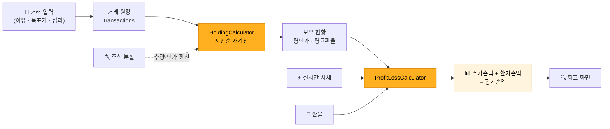
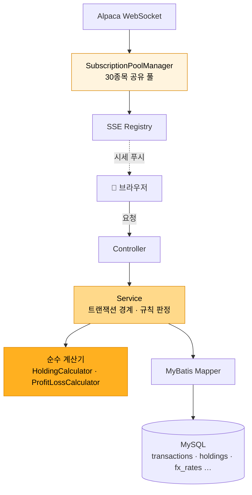

<h1 align="center">📈 미장 · MIJANG</h1>

<h3 align="center">미국 주식의 매매 기록과 당시의 판단을 함께 남기는 투자 회고 서비스</h3>

<br/>

> 매수 이유 · 목표가 · 심리까지 기록 → 보유 현황 · 손익 자동 계산 → 이후 주가와 비교하며 회고.<br/>
> **원화 손익을 주가의 영향과 환율의 영향으로 분리.** 거래 원장 재계산 · 주식 분할 반영 · 실시간 시세 · AWS 배포까지 혼자 완성.

<br/>

## 프로젝트 개요

**왜 만들었나** — 매매 앱은 "얼마를 벌었는가"만 보여주고, "왜 그런 결과가 나왔는가"는 남지 않음.
주식을 살 때의 이유와 실제 결과를 나란히 두고 돌아보는 습관을 위해, 거래 기록 위에 판단 기록을 얹은 서비스를 제작.
사용자가 이미 체결한 거래를 직접 기록하는 방식 — 실제 주문을 실행하는 증권 서비스가 아님.

**왜 손익을 둘로 나누나** — 미국 주식의 원화 손익에는 주가와 환율이 섞여 있음.
주가가 올라도 환율이 내리면 원화로는 손해일 수 있는데, 합산 숫자 하나로는 내 **종목 선택**이 맞았는지
**환율 타이밍**이 좋았는지 구분 불가. 그래서 주가손익과 환차손익을 분리해 보여주는 것을 핵심 기능으로 설계.

| | |
| --- | --- |
| **기간 · 인원** | 2026.08 – 09 · 개인 프로젝트 |
| **아키텍처** | Spring Boot 레이어드 — Controller · Service · 순수 계산기 분리 |
| **DB** | MySQL 8 · MyBatis |
| **외부 연동** | Alpaca 시세 WebSocket · Open Exchange Rates 환율 · OAuth · 메일 |
| **배포** | AWS EC2 · Nginx · HTTPS |
| **소스** | 코드는 [`develop`](https://github.com/jeonggul/mijang/tree/develop) 브랜치에서 관리 |

**담당 범위** — 기획 · DB 설계 · 백엔드 · 화면 · 테스트 · 배포 전부.

<br/>

## 주요 기능

| | 기능 | 무엇으로 어떻게 구현했나 |
| :--: | --- | --- |
| 📝 | **매매 기록 + 판단 기록** | 매수·매도에 매매 이유 · 목표가 · 당시 심리를 함께 저장. 회고 화면에서 이후 주가 추이와 대조 |
| 📊 | **보유 현황 재계산** | 거래 원장을 시간순으로 훑어 평단가(이동평균) · 평균매수환율(금액가중)을 산출. 파생값은 저장하지 않고 매번 유도 |
| 💱 | **주가 · 환차 손익 분리** | `주가손익 = 수량 × (현재가 − 평단가) × 현재환율`, `환차손익 = 수량 × 평단가 × (현재환율 − 평균매수환율)` — 합이 곧 평가손익 |
| 🪓 | **주식 분할 반영** | 원본 거래는 보존하고, 계산 시점에 분할 이전 거래의 수량·단가만 환산. 기준일 당일 경계를 테스트로 고정 |
| ⚡ | **실시간 시세** | 서버가 Alpaca WebSocket 1개를 공유 구독하고 브라우저에는 SSE로 전달. 벤더의 30종목 한도를 구독 풀로 관리 |
| 💰 | **배당 · 양도세** | 배당 일정과 연간 양도소득 계산을 거래 원장에서 유도 |
| 🧾 | **커뮤니티 매매 카드** | 게시글에 실제 매도 기록의 수익률 카드를 첨부 — 수익률은 그 매도 시점의 원가에서 계산 |
| 🔐 | **인증** | JWT를 HttpOnly 쿠키로 전달, 비밀번호 버전 검사로 변경 이후 기존 토큰 무효화 |

<br/>

### 핵심 — 거래 한 건이 손익 화면이 되기까지



계산기 두 개는 **DB도 스프링도 모르는 순수 계산** — 입력과 출력만 있어 단위 테스트가 쉬운 모양으로 분리.
이 서비스에서 가장 틀리면 안 되는 코드이기 때문.

> 📄 [`HoldingCalculator`](https://github.com/jeonggul/mijang/blob/develop/src/main/java/com/example/mijang/portfolio/service/HoldingCalculator.java) · [`ProfitLossCalculator`](https://github.com/jeonggul/mijang/blob/develop/src/main/java/com/example/mijang/portfolio/service/ProfitLossCalculator.java)

<br/>

## 기술 스택

| 구분 | 사용 | 선택 이유 |
| --- | --- | --- |
| **언어** | Java 17 | 주 언어. 금액 연산은 전부 `BigDecimal` + 자리수·반올림 명시 |
| **프레임워크** | Spring Boot · Spring MVC | 레이어 분리와 트랜잭션 경계를 선언적으로 관리 |
| **DB 접근** | MyBatis · MySQL 8 | 손익·통계처럼 SQL이 복잡한 조회가 많아 쿼리를 직접 쓰는 쪽을 선택 |
| **화면** | Thymeleaf · JavaScript | 서버 렌더링 + 시세·차트만 JS로 부분 갱신 |
| **실시간** | Alpaca WebSocket → SSE | 수신(벤더 1연결)과 전달(브라우저 N연결)을 분리 — 브라우저마다 벤더에 붙으면 한도 즉시 초과 |
| **인증** | JWT (HttpOnly 쿠키) · OAuth | 세션 없는 인증 + 소셜 로그인 |
| **테스트** | JUnit | 계산기 · 거래 수정 · 분할 경계 등 핵심 로직 단위 테스트 |
| **인프라** | AWS EC2 · Nginx · HTTPS | 실제 배포 환경에서의 문제(스키마 차이 · 프록시 뒤 OAuth)까지 경험 |

<br/>

## 실행 방법

**요구 사항** — JDK 17 · MySQL 8

**1. 설정 파일 작성**

```bash
git clone https://github.com/jeonggul/mijang.git && cd mijang
git switch develop
cp src/main/resources/application-secret.properties.example \
   src/main/resources/application-secret.properties
```

`application-secret.properties`에 DB 접속 정보 · JWT 서명 키 · 외부 API 키(환율은 `mijang.fx.app-id`)를 입력.
실제 키와 비밀번호는 커밋하지 않음.

**2. DB 준비** — MySQL에 `mijang` 데이터베이스를 만들고, 별도 관리하는 스키마·마이그레이션 SQL을 날짜순으로 적용
(DB 문서는 저장소 밖에서 관리 — 복제만으로 DB가 생성되지는 않음)

**3. 실행**

```bash
./gradlew bootRun --args='--mijang.batch.enabled=false'   # 외부 수집 끄고 로컬 확인
```

→ http://localhost:8080 · 시세·환율 데이터가 없는 화면은 빈 상태로 표시될 수 있음

**4. 테스트**

```bash
./gradlew test
```

주요 검증 대상 — 손익 분해 합계 · 이동평균 · 거래 수정 · 주식 분할 기준일 · 인증.
[`ProfitLossCalculatorTest`](https://github.com/jeonggul/mijang/blob/develop/src/test/java/com/example/mijang/portfolio/ProfitLossCalculatorTest.java) · [`HoldingCalculatorTest`](https://github.com/jeonggul/mijang/blob/develop/src/test/java/com/example/mijang/portfolio/HoldingCalculatorTest.java) · [`TransactionUpdateTest`](https://github.com/jeonggul/mijang/blob/develop/src/test/java/com/example/mijang/portfolio/TransactionUpdateTest.java) · [`StockSplitAdjustTest`](https://github.com/jeonggul/mijang/blob/develop/src/test/java/com/example/mijang/portfolio/StockSplitAdjustTest.java)

<br/>

## 구조 · 설계



**왜 계산기를 Service에서 또 분리했나** — 평단가·손익 계산이 Service에 섞여 있으면 DB를 띄워야만 검증 가능.
"산수"(계산기)와 "규칙 판정"(Service — 초과 매도 거절 등)을 나눈 결과, 가장 틀리면 안 되는 코드가
가장 테스트하기 쉬운 코드가 됨. 같은 계산을 두 곳에 두지 않는 것도 원칙 — 합계와 건별 값이 갈라지는 날이 오기 때문.

<details>
<summary><b>폴더 구조</b></summary>

```
src/main/java/com/example/mijang/
├── portfolio/   # ★ 거래 원장 · 보유 현황 · 손익 · 회고 (서비스의 심장)
│   └── service/ #   HoldingCalculator · ProfitLossCalculator · TransactionService
├── stock/       # 종목 정보 · 일봉 · 주식 분할
├── market/      # 시세 수신(WebSocket) · 구독 풀 · SSE
├── fx/          # 환율 수집 · 확정
├── dividend/    # 배당
├── user/        # 회원 · 소셜 로그인
├── security/    # JWT 인증 · 권한
├── community/   # 게시글 · 매매 카드
├── admin/       # 운영 관리
└── web/         # 화면 라우팅
src/main/resources/
├── mapper/      # MyBatis SQL
├── templates/   # Thymeleaf 화면
└── static/      # JavaScript · CSS
```

</details>

<br/>

## 트러블슈팅

### 1. 과거 날짜로 끼워 넣은 매도가 "보유보다 많이 판" 것을 통과

- **문제** — 매도 거절 기준을 **최종 보유 수량**으로 검사하던 초기 구현.
  `매수 5주 → 매도 8주 → 매수 10주`를 순서대로 기록하면 최종 수량은 7주로 양수지만,
  중간의 매도 시점에는 5주뿐이라 성립하지 않는 거래. 이때 계산은 원가를 0으로 놓고
  매도대금 전액을 이익으로 잡아 **평단가와 실현손익이 함께 틀어짐**
- **고려한 선택지**

  | 선택지 | 문제 |
  | --- | --- |
  | ① 입력 시점의 현재 보유량과 비교 | 과거 날짜로 끼워 넣는 거래를 못 잡음 — 문제의 원인 그 자체 |
  | ② 해당 날짜까지의 누적 수량만 검사 | 그 **뒤** 날짜의 매도가 깨지는 경우(수정·삭제)를 못 잡음 |
  | ③ **전체 재계산하며 "도중의 최저 수량" 추적** | 재계산 비용 발생 |

- **선택** — ③. 거래 추가·수정·삭제 때마다 그 종목을 처음부터 재계산하면서, 훑는 **도중**
  수량이 내려간 최저값(`minQuantity`)을 추적. 한 번이라도 음수가 되면 보유를 넘겨 판 시점이
  있었다는 뜻이므로 예외를 던지고, 거래 저장과 재계산을 **하나의 트랜잭션**으로 되돌림

  ```java
  // HoldingCalculator — 마지막 값만 보면 과거 날짜로 끼워 넣은 초과 매도를 놓친다.
  // 뒤에 오는 매수가 수량을 도로 양수로 만들어 주기 때문이다.
  minQuantity = minQuantity.min(quantity);
  ...
  public boolean oversold() {
      return minQuantity.compareTo(BigDecimal.ZERO) < 0;
  }
  ```

  개인 기록 서비스라 종목당 거래가 수백 건 수준 — 전체 재계산 비용은 감수 가능하다고 판정
- **결과** — 어떤 순서·어떤 날짜로 입력해도 성립하지 않는 매도는 저장되지 않고,
  저장과 재계산이 함께 롤백되어 원장과 보유 현황이 어긋난 상태 자체가 불가
- **배운 점** — 시계열 데이터의 검증은 "지금 상태"가 아니라 **"전체 이력을 다시 재생한 결과"** 로 해야 함.
  최종값 검사는 중간이 깨진 이력을 통과시킴

> 📄 [`HoldingCalculator.calculateAll()`](https://github.com/jeonggul/mijang/blob/develop/src/main/java/com/example/mijang/portfolio/service/HoldingCalculator.java#L163-L217) · [`TransactionService`](https://github.com/jeonggul/mijang/blob/develop/src/main/java/com/example/mijang/portfolio/service/TransactionService.java#L99-L104) — 재계산을 같은 트랜잭션에 묶는 지점

<br/>

### 2. 평균매수환율을 수량으로 가중했더니 환차손익이 왜곡

- **문제** — 평균매수환율을 수량 가중평균으로 계산한 초기 구현.
  $500짜리 1주와 $5짜리 100주는 같은 "100주대"여도 환율에 노출된 **금액**이 100배 차이.
  수량으로 가중하면 싼 종목을 산 날의 환율이 평균을 지배해, 분리해 둔 환차손익이 실제와 어긋남
- **선택** — 가중치를 수량이 아니라 **매수 금액(USD)** 으로 교체.
  매도는 평단가와 평균환율을 바꾸지 않는다는 규칙도 함께 고정 — 판 것은 남은 것의 원가와 무관

  ```java
  // HoldingCalculator.weightedFx() — 수량이 아니라 매수 금액으로 가중
  return existingCost.multiply(existingFx)
          .add(addedCost.multiply(addedFx))
          .divide(totalCost, FX_SCALE, RoundingMode.HALF_UP);
  ```

- **결과** — 환차손익이 실제 환전 노출 금액 기준으로 계산되고, `주가손익 + 환차손익 = 평가손익` 합계가 항상 성립
- **배운 점** — 평균을 구할 때 **무엇으로 가중하는가**가 곧 그 숫자의 의미.
  공식을 코드로 옮기기 전에 "이 평균이 답해야 할 질문"을 먼저 정의해야 함

> 📄 [`HoldingCalculator.weightedFx()`](https://github.com/jeonggul/mijang/blob/develop/src/main/java/com/example/mijang/portfolio/service/HoldingCalculator.java#L219-L236) · [`ProfitLossCalculator`](https://github.com/jeonggul/mijang/blob/develop/src/main/java/com/example/mijang/portfolio/service/ProfitLossCalculator.java#L54-L108) — 분리 공식

<br/>

### 3. 주식 분할 이후 보유 수량과 평가금액이 뒤틀림

- **문제** — 4:1 분할 종목은 시세가 분할 조정된 가격으로 내려오는데, 분할 **전**에 기록한 거래는
  옛 단가 그대로. 그대로 비교하면 평가손익이 4배 규모로 왜곡
- **고려한 선택지**

  | 선택지 | 문제 |
  | --- | --- |
  | ① 분할 시점에 원본 거래의 수량·단가를 UPDATE | 원장이 "기록한 적 없는 값"으로 바뀜. 사용자가 쓴 기록이 말없이 수정됨 |
  | ② **원본은 보존, 계산 시점에만 환산** | 계산마다 환산 비용 — 순수 함수라 테스트로 고정 가능 |

- **선택** — ②. 원장은 고쳐 쓰지 않는다는 원칙 유지. 보유 현황을 계산할 때 분할 기준일(`exDate`)보다
  **앞선** 거래만 수량 × 배수, 단가 ÷ 배수로 환산 — 체결 금액은 그대로(분할은 몫을 쪼갤 뿐 돈이 오가지 않음).
  기준일 **당일** 거래는 이미 조정된 값으로 체결되므로 보정 대상에서 제외 — 이 경계를 하루 잘못 잡으면
  그날 산 사람의 수량만 배수만큼 틀어지는데 화면에는 그냥 "수량이 이상하다"로만 보임. 경계 조건을 테스트로 고정
- **결과** — 분할 전 거래와 분할 조정 시세가 같은 기준으로 비교되고, 사용자의 원본 기록은 입력 그대로 보존
- **배운 점** — **원장은 사실의 기록, 보유 현황은 해석의 결과.** 사실을 고치는 대신 해석 단계에서 환산하면
  "언제 무엇을 기록했는가"가 영원히 남음

> 📄 [`HoldingCalculator.adjustForSplits()`](https://github.com/jeonggul/mijang/blob/develop/src/main/java/com/example/mijang/portfolio/service/HoldingCalculator.java#L116-L155) · [`StockSplitAdjustTest`](https://github.com/jeonggul/mijang/blob/develop/src/test/java/com/example/mijang/portfolio/StockSplitAdjustTest.java)

<br/>

### 4. 사용자마다 시세를 구독하면 벤더 한도 30종목을 즉시 초과

- **문제** — 시세 벤더(Alpaca)의 동시 구독 한도는 30종목. 브라우저마다 벤더에 직접 붙거나
  사용자별로 구독을 만들면 몇 명만 접속해도 한도 초과
- **선택** — 수신과 전달을 분리. 서버가 벤더 WebSocket **1개**를 유지하고, 브라우저에는 SSE로 전달.
  같은 종목을 여러 사람이 봐도 구독은 하나로 치고, 구독 풀이 30종목 한도를 지키는 유일한 장치가 되도록
  `synchronized` 풀 하나에 판단을 모음. 한도를 넘은 종목은 실시간 대신 **종가로 표시** — 기능을 깨는 대신 품질을 낮추는 선택
- **결과** — 동시 접속자 수와 무관하게 벤더 연결은 1개, 구독은 최대 30종목으로 고정
- **배운 점** — 외부 자원의 한도는 **한 곳에서만** 지켜져야 함. 판단이 흩어지면 한 곳만 고쳐지는 날이 옴

> 📄 [`SubscriptionPoolManager`](https://github.com/jeonggul/mijang/blob/develop/src/main/java/com/example/mijang/market/pool/SubscriptionPoolManager.java)

<br/>

### 5. 로컬에서 되던 로그인이 EC2에서만 실패

- **문제** — 배포 직후 로그인 오류. 원인은 두 갈래 — ① 배포 DB의 스키마가 애플리케이션이 기대하는
  컬럼과 달랐고, ② HTTPS 프록시(Nginx) 뒤에서 OAuth 콜백 URL이 `http://`로 생성되어 등록된 콜백과 불일치
- **선택** — ① 애플리케이션이 요구하는 컬럼과 배포 DB 구조를 대조해 마이그레이션을 날짜순으로 재적용.
  ② Nginx의 전달 헤더(X-Forwarded-Proto)를 애플리케이션이 신뢰하도록 설정하고 등록된 콜백 주소와 일치시킴
- **결과** — 배포 환경에서 일반 로그인과 소셜 로그인 모두 정상 동작
- **배운 점** — "로컬에서 된다"는 코드 검증일 뿐. **배포 환경의 DB 상태와 요청 경로(프록시가 바꾸는 것들)** 는
  별도의 검증 대상이며, 마이그레이션을 저장소 안에서 재현 가능하게 관리해야 이 문제가 반복되지 않음

<br/>

## 회고

**얻은 것**

기획부터 배포까지 전부 혼자 결정하며, **저장할 값(원장)과 유도되는 값(보유 현황·손익)을 구분하는 감각**을 얻음.
가장 틀리면 안 되는 계산을 순수 함수로 떼어 테스트로 고정하는 습관, 그리고 `BigDecimal` 자리수·반올림을
명시하지 않으면 금액이 조용히 어긋난다는 것을 몸으로 학습.

**아쉬운 것**

- 시세 수집·구독 상태가 인스턴스 메모리에 있어 다중 인스턴스 확장 불가
- DB 스키마·마이그레이션이 저장소 밖에 있어 복제만으로 실행 환경을 재현할 수 없음 — 5번 트러블슈팅의 근본 원인
- 배포 후 상태 확인이 로그 직접 조회뿐. 운영 관측(헬스체크·메트릭) 부재

**다시 만든다면**

- 마이그레이션 도구(Flyway 등)를 처음부터 저장소에 포함
- 구독 풀 상태를 외부 저장소로 옮겨 수평 확장 가능한 구조로
- 손익 분해처럼 합계가 성립해야 하는 계산은 속성 기반 테스트로 검증 강화

---

개인 학습 및 포트폴리오 프로젝트입니다. 실제 주문을 실행하는 증권 거래 서비스가 아니며, 투자 자문을 목적으로 하지 않습니다.

<br/>

<div align="center">
<sub>

**이정하** · [GitHub](https://github.com/jeonggul) · dlwjdgkw@gmail.com

</sub>
</div>
